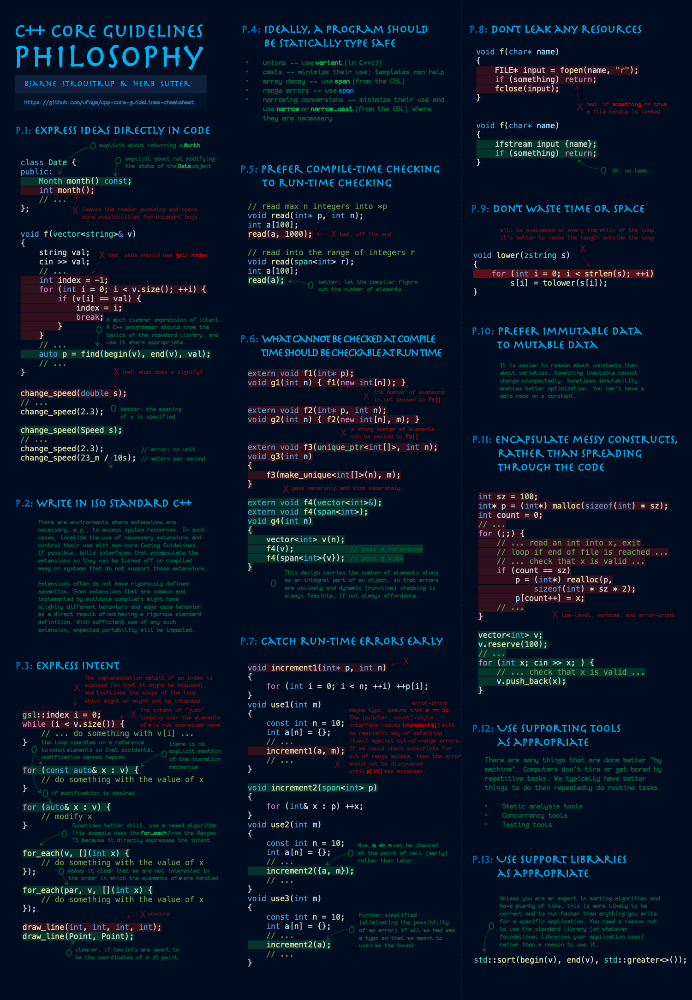

# cpp-core-guidelines-cheatsheet
 Cheatsheet for the C++ core guidelines, including a set of tried-and-true guidelines, rules, and best practices about coding in C++.

- [x] P: Philosophy
- [ ] I: Interfaces
- [ ] F: Functions
- [ ] C: Classes and class hierarchies
- [ ] Enum: Enumerations
- [ ] R: Resource management
- [ ] ES: Expressions and statements
- [ ] Per: Performance
- [ ] CP: Concurrency and parallelism
- [ ] E: Error handling
- [ ] Con: Constants and immutability
- [ ] T: Templates and generic programming
- [ ] CPL: C-style programming
- [ ] SF: Source files
- [ ] SL: The Standard Library

---

### P: Philosophy 
- [[Download PDF]](Philosophy.pdf) 
- [[Download PNG Image]](Philosophy.png)

